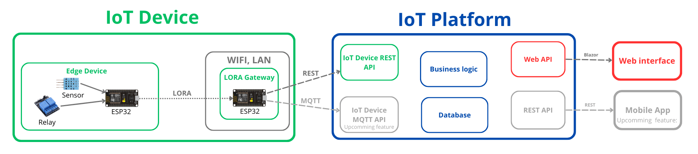

# Sparrow IoT Platform - Open Source agricultural .NET Core IoT Server

This is an easy to use self-hostable IoT platform for farmers and gardeners. Designed to offer a cheap and simple way to monitor local environmental conditions and automate watering and heating systems.

**⚠️This project is under development, not working right now.⚠️**

## Goal

Years ago my family bio farm wanted some kind of temperature monitoring, low-temperature warning, and irrigation automatizing system, we tried many kinds of solutions, but we couldn't find any affordable and reliable one. 

- Industrial Agricultural IoT Systems
	- Very expensive
	- Very reliable
	- Very easy to setup and use
- [Arduino Cloud](https://cloud.arduino.cc/), [Blynk](https://blynk.io/) - Cloud-based IoT systems
	- Not cheap, but much better
	- Easy to build and use
	- Evolving fast, which makes them not enough reliable for us
	- Most of them do not store enough data
- [Home Assistant](https://www.home-assistant.io/), [OpenHAB](https://www.openhab.org/) - Self-hosted Open Source solutions
	- Running the server on our computer is expensive and complicated
	- They are very complex, so hard to setup and use
	- You can do anything with them
	- The maintenance takes a lot of time

We need a simple, reliable, and in the long-term cheap solution to build data logging, visualizing, and automating systems for small farms and gardens.

## Our Solution

Is a simple Dockerized .NET Core + Blazor IoT server, which can run on the cheapest VPS or a Raspberry Pi and some cheap ESP32-based IoT devices. It is designed to be easy to use, easy to setup, and easy to maintain.

To make the setup process as easy as possible, we are planning to create tutorials in the platform, so you can build full agriculture automatization systems without coding with easy to follow step by step guides, which contain everything from assembling the ESP32, through uploading the firmware to customizing the dashboard.

### Features

- Easily Hostable on cheap VPS or Raspberry Pi
- No maintenance required
- Simple, responsive, and customizable dashboard
- Data logging and visualization
- Alerts and notifications
- Reliable automatization

## Information for Developers

This project is in the early development phase, not ready for production use.

### Project Documentation

- [Base idea](https://docs.google.com/document/d/1oyASZ_bG17uwzgr_NtaMfHdZ23nmU8OKUYntWb3Y-co/edit?usp=sharing)
- [Requirements](https://docs.google.com/document/d/1Xc6wAokgXtEZXZMK82HhEkOIH8bnE58knpkK7C6dygk/edit?usp=sharing)
- [System Design](https://docs.google.com/document/d/17BKCvN3vBGUPituyRiiUNVXURcatZrLEXiF8VPOVh7I/edit?usp=sharing)

### Architecture Overview

The server was built with onion architecture and SOLID principles to make it extendable and testable.

- **Application.Core** - Contains the domain model and interfaces
- **Application.Application** - Contains the application services
- **Application.Infrastructure** - Contains the Database and logging implementations
- **Application.DeviceRestApi** - Contains an ASP.NET Core Web API for the IoT devices
- **Application.BlazorWebInterface** - Contains the Blazor WebAssembly frontend

## Usage - not ready yet